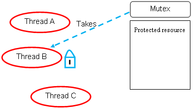
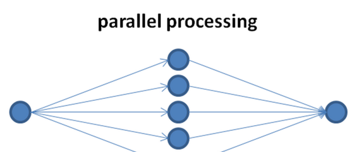

# Manual técnico

## Practica 2

---

##### Diego Andrés Huite Alvarez - 202003585

---

**Descripción:**

Las corporaciones utilizan computadoras de alto rendimiento llamadas mainframes para aplicaciones que dependen de la escalabilidad y la confiabilidad. Por ejemplo, una institución bancaria podría utilizar un mainframe para alojar la base de datos de las cuentas de sus clientes, a las cuales se pueden enviar transacciones desde cualquiera de los miles de cajeros automáticos en todo el mundo. La práctica consiste en desarrollar una aplicación de consola en C que permita almacenar los datos de usuario de un banco, así como realizar operaciones monetarias como depósitos, retiros y transacciones.

**Estructura de la práctica:**

```
Practica2
├── bin
│   └── main
├── compile-command.txt
├── README.md
├── src
│   ├── include
│   │   ├── data_loader.h
│   │   ├── menus.h
│   │   ├── operations.h
│   │   ├── structures.h
│   │   └── utils.h
│   ├── main.c
|   ├── data_loader.c
│   ├── menus.c
│   ├── operations.c
│   └── utils.c
├── transactions.csv
└── users.csv
```

- **src:** Contiene todo el código fuente de la práctica 2

- **src/include:** Contiene archivos header donde se declaran las estructuras a utilizar así como también se declaran funciones de uso compartido.

- **bin:** Contiene el ejecutable de la práctica 2, para un sistema linux x68_64

Para solventar el problema principal, se tiene, un archivo con usuarios en formato .csv, que luce de la siguiente manera:

```csv
no_cuenta,nombre,saldo
2096,Euell Carney,14106.51
4929,Karlan Canario,35494.49
6361,Christian Houlton,30065.45
9470,Quinlan Turnell,48972.01
3959,Rosemonde Champ,36898.15
4294,Colver Brassington,17468.47
5237,Ab Kauschke,quinientos mil
3974,Mariana Casetti,43004.96
6941,Traci Vasyutkin,3065.04
3785,Sherrie Beccera,34013.51
5167,Sarene Wisbey,2402.29
7297,Ransell Gull,19817.12
3576,Oralee Suggey,39538.9
7190,Marline Terbeek,33383.88
4120,Kaitlyn Pirrey,21693.65
8364,Steffane Cavaney,9417.79
9439,Billye Elen,48221.58
5972,Mirna Twigger,28915.8
5006,Mathew Beeson,-3200.6
3158,Vittoria Jedrzej,20205.7
8997,Aguste Beebee,11742.26

..continua
```

Y otro archivo que contiene transacciones de la siguiente manera:

```csv
operacion,cuenta1,cuenta2,monto
1,8364,4288,500
3,8178,4775,1931.39
2,5369,0,400
3,5630,5237,3657.11
1,7053,0,4652.31
2,4895,0,1335.51
1,5349,0,3873.6

... continua
```

En cuanto al archivo de operaciones, cada atributo operación correspone a una acción a tomar, para nuestro caso, cada número representa:

1. Deposito

2. Retiro

3. Transferencia

Es importante tomar en cuenta que las siguientes estructuras son utilizadas para leer el archivo, estas estructuras están definidas en "structures.h"

```c
#include <stdio.h>

struct User {
    int id;
    char name[50];
    float saldo;
};

struct ThreadData{
    FILE* file;
    long start_pointer;
    int line_count;
    int users_added;
} ;

struct ThreadTransactionData{
    FILE* file;
    long start_pointer;
    int line_count;
    int retirements_added;
    int deposits_added;
    int transfers_added;
} ;

struct ErrorData{
    char message[100];
} ;

struct ErrorTransactionData{
    char message[100];
} ;

// create user array
extern int num_users;
extern struct User users[500];


// create user load error array
extern int num_errors_user_load;
extern struct ErrorData errors_user_load[500];


// create user load error array
extern int num_errors_transaction_data;
extern struct ErrorTransactionData errors_transaction_data[500];
```

Para leer el archivo de usuarios, en el archivo data_loader.c, se encuentra en la función "separate_file" el siguiente fragmento de código:

```C
   void separate_file(FILE *file, char *file_path)
{
    char line[MAX_LEN];

    int total_lines = count_lines(file);
    fgets(line, sizeof(line), file);

    int linesPerWorker = total_lines / NUM_THREADS;
    int remaininglines = total_lines % NUM_THREADS;

    int linesForWorker1 = linesPerWorker;
    int linesForWorker2 = linesPerWorker;
    int linesForWorker3 = linesPerWorker + remaininglines;

    long fp_thread_1 = ftell(file);

    for (int i = 0; i < linesForWorker1; i++)
    {
        char *test = fgets(line, sizeof(line), file);
    }

    long fp_thread_2 = ftell(file);

    for (int i = 0; i < linesForWorker2; i++)
    {
        char *test = fgets(line, sizeof(line), file);
    }

    long fp_thread_3 = ftell(file);

    // Create threads
    pthread_t threads[NUM_THREADS];

    struct ThreadData data_threads[3];
    long pointers[3] = {fp_thread_1, fp_thread_2, fp_thread_3};

    for (int i = 0; i < NUM_THREADS; i++)
    {
        FILE *file = open_file(file_path);
        data_threads[i].file = file;
        data_threads[i].start_pointer = pointers[i];
        data_threads[i].users_added = 0;
    }

    data_threads[0].line_count = linesForWorker1;
    data_threads[1].line_count = linesForWorker2;
    data_threads[2].line_count = linesForWorker3;
```

En donde se define la carga de trabajo para cada hilo, en este caso, cuantas líneas tendrá que leer cada hilo, luego, se recorre fila por fila, para determinar en que punto el hilo tendrá que leer el archivo, para luego iniciar un mutex que se va a encargar de proteger áreas críticas del código, en este caso la modificación de un arreglo que contiene todos los usuarios registrados.

```C
pthread_mutex_init(&mutex, NULL);

    for (int i = 0; i < NUM_THREADS; i++)
    {
        int rc = pthread_create(&threads[i], NULL, thread_read, (void *)&data_threads[i]);
        if (rc)
        {
            printf("ERROR: return code from pthread_create() is %d\n", rc);
            return;
        }
    }

    // Wait for threads to finish
    for (int i = 0; i < NUM_THREADS; i++)
    {
        pthread_join(threads[i], NULL);
    }

    pthread_mutex_destroy(&mutex);

    printf("*******Usuarios cargados*******\n");
    create_user_load_report(data_threads);
}
```

La subrutina asociada a cada hilo es la siguiente:

```C
void *thread_read(void *thread_data)
{
    struct ThreadData *thread_file_pointer = (struct ThreadData *)thread_data;
    FILE *file = thread_file_pointer->file;
    long start_pointer = thread_file_pointer->start_pointer;
    int line_count = thread_file_pointer->line_count;
    fseek(file, start_pointer, SEEK_SET);
    char line[MAX_LEN];
    int counter = 0;
    pthread_mutex_lock(&mutex);

    while (fgets(line, sizeof(line), file) && counter < line_count)
    {

        // user data
        int no_cuenta = -1;
        char nombre[50] = "";
        float saldo = -1;
        // ===============
        bool error_found = false;

        char *token = strtok(line, ",");
        int column = 0;
        while (token != NULL)
        {

            if (column == 0)
            {
                no_cuenta = atoi(token);
                if (no_cuenta <= 0 && token[0] != '0')
                {
                    if (num_errors_user_load < 500)
                    {
                        struct ErrorData new_error;
                        sprintf(new_error.message, "Error: codigo debe de ser un entero positivo %s", token);
                        strcpy(errors_user_load[num_errors_user_load].message, new_error.message);
                        num_errors_user_load++;
                    }
                    error_found = true;
                    break;
                }
            }
            else if (column == 1)
            {
                // compare that the name is not empty string
                if (strcmp(token, "") == 0)
                {

                    if (num_errors_user_load < 500)
                    {
                        struct ErrorData new_error = {"Error: nombre no puede ser una cadena vacía.\n"};
                        strcpy(errors_user_load[num_errors_user_load].message, new_error.message);
                        num_errors_user_load++;
                    }
                    error_found = true;
                    break;
                }
                strcpy(nombre, token);
            }
            else if (column == 2)
            {
                saldo = atof(token);

                if (!isFloat(token) || saldo < 0)
                {
                    if (num_errors_user_load < 500)
                    {
                        struct ErrorData new_error;
                        sprintf(new_error.message, "Error: saldo debe de ser un positivo real %s", token);
                        strcpy(errors_user_load[num_errors_user_load].message, new_error.message);
                        num_errors_user_load++;
                    }
                    error_found = true;
                    break;
                }
            }

            token = strtok(NULL, ",");
            column++;
        }

        if (!error_found)
        {
            bool repeated_value = false;
            for (int i = 0; i < num_users; i++)
            {
                if (users[i].id == no_cuenta)
                {

                    if (num_errors_user_load < 500)
                    {
                        struct ErrorData new_error;
                        sprintf(new_error.message, "Error: El usuario con el no. de cuenta %d ya existe.\n", no_cuenta);
                        strcpy(errors_user_load[num_errors_user_load].message, new_error.message);
                        num_errors_user_load++;
                        repeated_value = true;
                    }
                    break;
                }
            }
            if(!repeated_value){
                if (num_users < 500)
                {
                    struct User new_user = {no_cuenta};
                    strcpy(new_user.name, nombre);
                    new_user.saldo = saldo;
                    users[num_users] = new_user;
                    num_users++;
                    thread_file_pointer->users_added = thread_file_pointer->users_added + 1;
                }
            }


        }
        counter++;
    }

    pthread_mutex_unlock(&mutex);
    fclose(file);
    pthread_exit(NULL);
}
```

En donde, primero que nada, aprovechando el uso del puntero void del parámetro, recuperamos la estructura que nos ayuda a llevar el control del hilo, por lo que obtenemos con ello, el puntero del archivo, contadores para los reportes, etc.

Antes de empezar con la extracción y adición de información a las estructuras, se hizo uso del mutex, que protege esa zona del código donde podremos hacer modificaciones a estas estructuras.



Seguidamente, extraemos cada una de las líneas del archivo para extraer información valiosa como el nombre de usuario, saldo, y demás, para luego verificar que estos datos tengan una estructura coherente, como por ejemplo que el saldo debe de ser un número de punto flotante. Cuando se ecuentra un error, este es guardado en el arreglo de errores.

Si la línea leída cumple con todas las condiciones, entonces se procede a guardar el usuario, y continúa con la siguiente línea. Hasta que, el contador definido al inicio de la función llegue al límite definido en el primer ciclo while. Para que el hilo solo lea las líneas necesarias. Finalmente se desbloquea el mutex para el siguiente hilo que requiera acceder a esta sección crítica. 

El procedimiento para leer el archivo de transacciones es exactamente el mismo que el definido anteriormente, con la única diferencia de que serán cuatro hilos los encargados de leer las transacciones y efectuar operaciones sobre las cuentas de los usuarios.

